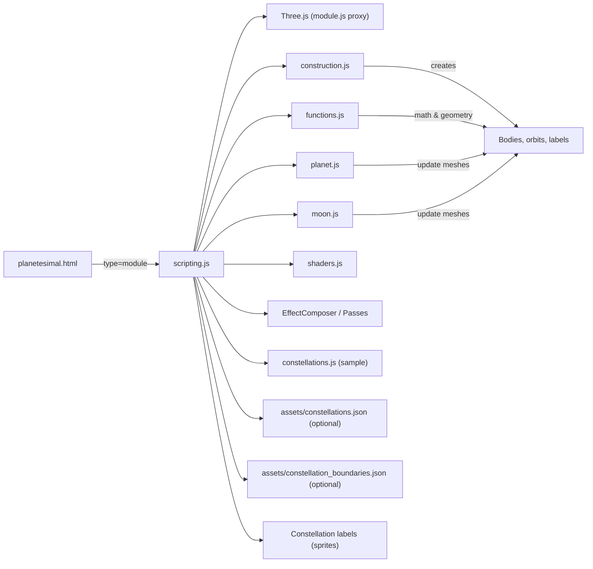
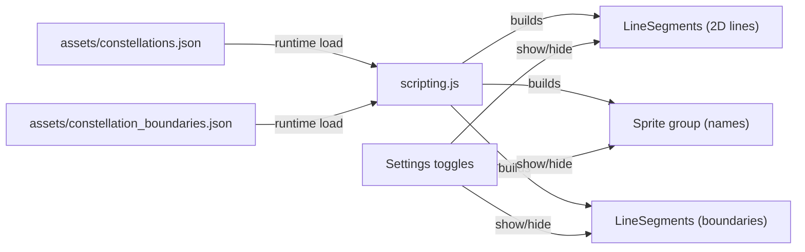
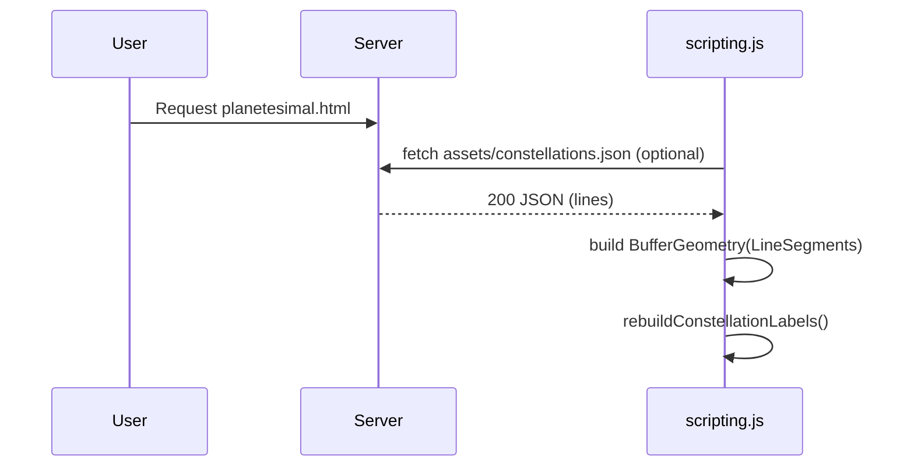

# Planetesimal — Solar System Web Simulation

A self-contained, client-side web simulation of the Solar System. It renders planets, moons, orbits, and a starfield using Three.js (ES modules) with interactive camera controls, labels, and a settings panel.

## Overview

- Static site: no build step; just serve over HTTP.
- Rendering: Three.js ES modules with post-processing (bloom) and custom shaders.
- Data: analytic ephemerides + static textures; optional constellation datasets.
- Interaction: orbit/trackball camera, single-click to focus bodies, hover cursor, time controls.

## Quick Start

- Serve the folder over HTTP (ES modules do not run via file://):
  - Python 3: `python -m http.server 8080`
  - Node: `npx http-server -p 8080`
- Open: `http://localhost:8080/planetesimal.html`

If you see “Unexpected token export” in `scripting.js`, verify that `planetesimal.html` loads it with `type="module"` and you aren’t opening the HTML via `file://`.

## Project Structure

```
.
├─ planetesimal.html          # Entry point (loads scripting.js as an ES module)
├─ scripting.js               # Main scene setup, animation loop, UI and input
├─ functions.js               # Math, transforms, orbit construction helpers
├─ construction.js            # Body definitions and mesh/orbit creation
├─ planet.js, moon.js         # Body classes and update logic
├─ shaders.js                 # GLSL shaders (orbits, atmosphere)
├─ module.js                  # Three.js ES module proxy (CDN/local)
├─ EffectComposer.js ...      # Three.js postprocessing modules
├─ assets/
│  ├─ flare*.jpg, cross.png   # Lens flare & sprites
│  ├─ constellations.json     # (Optional) full 2D constellation lines
│  ├─ constellation_boundaries.json  # (Optional) IAU boundary polylines
│  └─ hygdata_v3.csv / hyg_v42.csv   # (Optional) HYG star catalog (3D)
├─ textures/                  # Planet textures (Basis format)
├─ music/ambient.mp3          # Ambient audio
├─ convert-lines.js           # Convert d3-celestial lines → constellations.json
├─ convert-bounds.js          # Convert boundary GeoJSON → constellation_boundaries.json
└─ convert-hyg.js             # Convert HYG CSV → stars3d.json (optional)
```

### Module Relationships



### Constellation Components



## Features

- Physically inspired orbital motion for planets and moons.
- Trackball camera (rotate / zoom / pan) with damping.
- Single-click GoTo: click a body or its label to fly the camera there.
- Hover feedback: cursor switches to pointer over clickable meshes/labels.
- Info panel: object details; shows camera and time stats.
- Settings panel: toggle orbits, labels, atmospheres, dithering, meshes, exposure, music.
- Time controls: UI slider + keyboard accelerators and reverse.

## Controls

- Mouse:
  - Left-drag: rotate
  - Wheel: zoom
  - Right-drag: pan
- Click: focus body under cursor (also updates info)
- Double-click: focus body (legacy)
- Hotkeys:
  - `K` — pause/resume time
  - `,` / `.` — decelerate/accelerate time
  - `/` — reverse time direction
  - `` ` `` — toggle UI overlay
  - `I` — toggle info panel
  - `O` — toggle orbits
  - `T` — toggle labels

## Constellations (2D, optional)

You can add a full 2D constellation line set and boundaries rendered on the celestial sphere (RA/Dec). Lines/labels use angular positions (not distances).

1) Lines (all 88 constellations)
- Download:
  - https://raw.githubusercontent.com/ofrohn/d3-celestial/master/data/constellations.lines.json
- Save to: `assets/constellations.lines.json`
- Convert:
  - `node convert-lines.js`
  - Writes: `assets/constellations.json`

2) Boundaries (optional)
- Download:
  - https://raw.githubusercontent.com/ofrohn/d3-celestial/master/data/constellations.bounds.json
- Save to: `assets/constellations.bounds.json`
- Convert:
  - `node convert-bounds.js`
  - Writes: `assets/constellation_boundaries.json`

At runtime, the app replaces the small built-in sample with `assets/constellations.json` and rebuilds labels.

#### Constellation Data Flow



## 3D Stars (optional, off by default)

If you want a true 3D starfield (distance-aware) in addition to the 2D lines:

1) Download HYG catalog CSV (v3 or v4.2) to `assets/`
2) Convert:
- `node convert-hyg.js` → writes `assets/stars3d.json`

The 3D rendering code paths can be wired to show a Points cloud and optional 3D constellation lines. They’re left dormant by default to keep the 2D experience stable.

## Implementation Notes

- ES Modules: All core scripts use `import`/`export`. Ensure `planetesimal.html` loads `scripting.js` with `type="module"`.
- Basis textures: Basis transcoder path is configured; check Network for `basis_transcoder.*` if textures fail.
- Hover cursor: `onMouseMove` raycasts and updates `renderer.domElement.style.cursor` to `pointer`/`default`.
- Click-to-focus: The click handler raycasts into `major_castable` (far) or `Castable` (near), then `GoTo(owner)`.

### Sun Galactic Motion

- The Sun now drifts through the scene with an approximate galactic orbital speed of `~230 km/s` (230,000 m/s), representing motion around the Milky Way.
- Reference scale: positions are in scene units of `1e7 m` per unit; velocities are kept in SI (m/s) and integrated per simulated second.
- Integration: `stellar.update()` advances stellar positions using the simulated time `J_S` each frame and updates the point light/lens flare accordingly.
- Planets and moons inherit the parent body’s position/velocity (see `planet.js:46`), so the entire Solar System translates consistently with the Sun.
- Typical parameters: Galactocentric radius `R0 ≈ 8.2 kpc (≈2.53e20 m)`, circular speed near the LSR `v ≈ 230 km/s`, orbital period `T ≈ 220 Myr` (2πR0/v). This simulation applies a local linear drift suitable for Solar System timescales rather than rendering a full 8 kpc-scale orbit.

## Known Issues & Fixes

- SyntaxError: Unexpected token `export`
  - Ensure `scripting.js` is loaded with `type="module"` and served via HTTP, not `file://`.
- “Invalid or unexpected token” with `\r\n`
  - A literal CRLF string entered the file. Replace `\r\n` with real newlines and hard refresh.
- Only a few constellations appear
  - Confirm `assets/constellations.json` exists, loads (200), and hard-refresh with cache disabled.
- Can’t zoom past the sphere
  - Increase `controls.maxDistance` (e.g., `8e7`) to match the sky sphere radius.

## Development Tips

- Keep edits surgical; modules are reloaded by the browser directly.
- Use DevTools → Network to validate dataset fetches; disable cache when testing.
- Inspect scene state via Console:
  - `scene.children`
  - `constellationGroup.geometry.attributes.position.count`
  - `constellationLabels.visible`, etc.

## License

This is a reconstructed deployment of a website with third-party assets and data. Verify licensing for any external datasets (e.g., HYG, d3-celestial) before redistribution.
