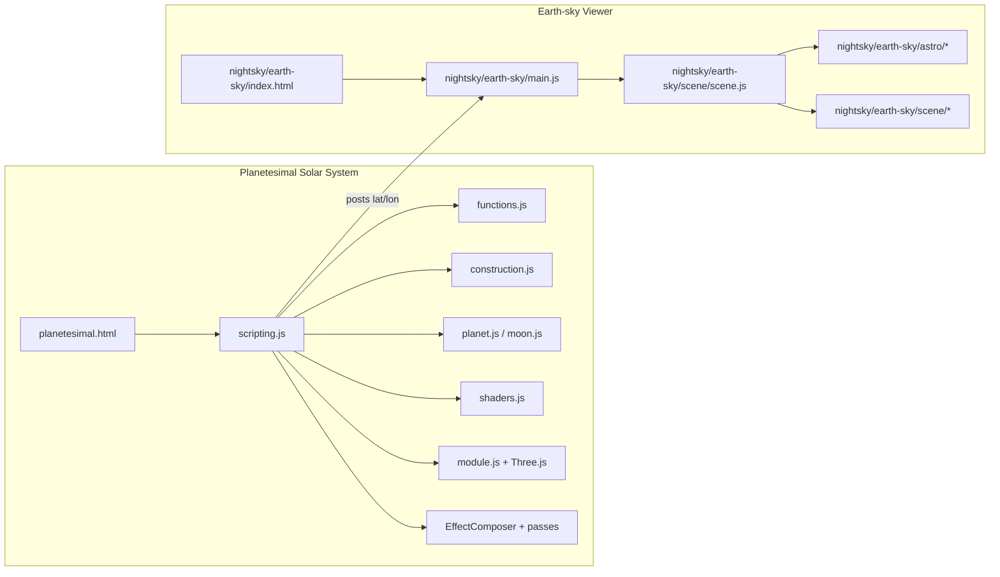
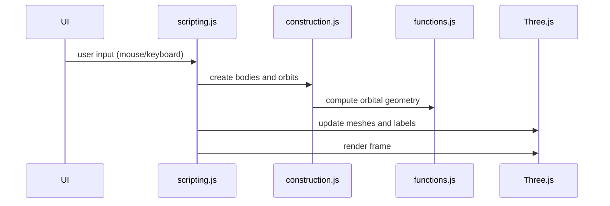
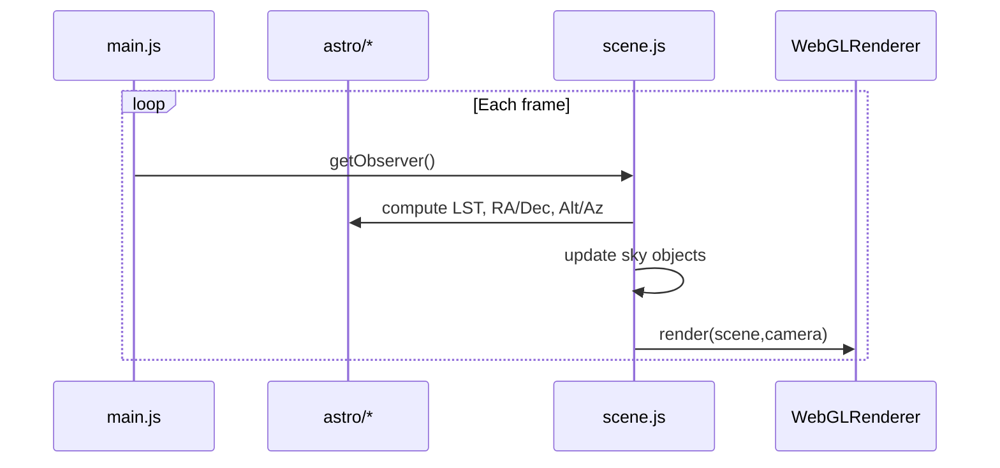

# System Architecture

## High-level structure

## Data flow for the Solar System scene

## Data flow for the Earth-sky viewer

## Key runtime systems

- **Scene graph**: All bodies, orbits, labels, and sky dome are Three.js objects.
- **Time system**: Simulation time is advanced by a configurable multiplier and applied to orbital motion and rotation.
- **Interaction**: Raycasting is used for selection, labels, and horizon placement.
- **Horizon disc**: A tangent plane positioned on Earth, oriented by the local surface normal and North/East basis.
