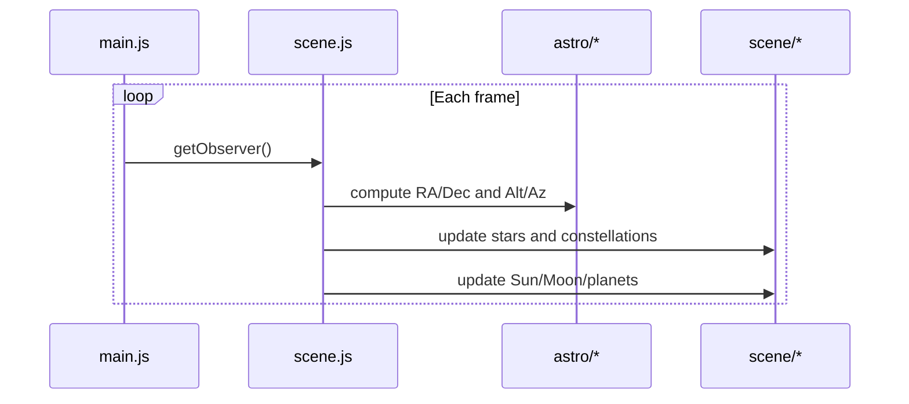

# Low-level Design: Earth-sky Viewer

## Key files and roles

- `nightsky/earth-sky/index.html` - UI and canvas
- `nightsky/earth-sky/main.js` - observer inputs, time, UI binding
- `nightsky/earth-sky/scene/scene.js` - scene graph and updates
- `nightsky/earth-sky/astro/*` - astronomy calculations
- `nightsky/earth-sky/scene/*` - stars, constellations, horizon, planets

## Observer snapshot

`main.js` exposes a snapshot that drives the entire view:

```
{ jd, latitudeDeg, longitudeDeg, lstDeg }
```

This is passed into the renderer each frame.

## Rendering flow



## Modes

- **Horizon mode**: Stars and constellations are reprojected into Alt/Az.
- **Dome mode**: Stars are fixed on the sky dome and the dome is rotated by LST.

## Picking and HUD

- Raycasting is used to select objects.
- Labels and tooltips are updated from the selected object state.
