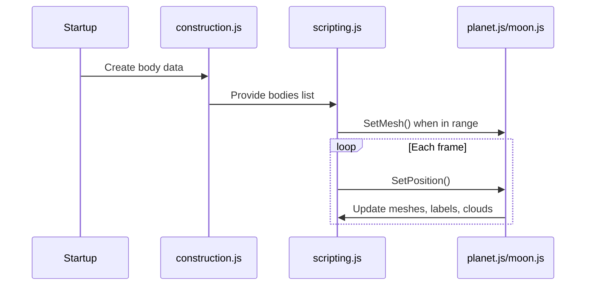

# Low-level Design: Planetesimal Solar System

## Key files and roles

- `scripting.js` - scene setup, UI, animation loop, input, raycasting
- `construction.js` - physical data and orbital elements
- `functions.js` - orbital calculations, transforms, orbits
- `planet.js` / `moon.js` - mesh creation and per-frame updates
- `shaders.js` - custom shaders for orbits and atmosphere

## Runtime lifecycle



## Selection and focus

```mermaid
flowchart TD
  A[click event] --> B[raycaster.setFromCamera]
  B --> C[intersectObjects(Castable/major_castable)]
  C --> D[select owner]
  D --> E[update info panel]
  D --> F[GoTo target]
```

## Time control

- Simulation time `J_S` increments by `time_rate`.
- Rotation is derived from `J_S / period`.
- Orbits are re-evaluated per frame using analytic Keplerian propagation.

## Asset loading

- Planet textures are Basis-compressed and loaded on demand.
- Atmospheres and clouds are separate meshes with their own materials.
- Distant meshes are disposed to reduce GPU memory.

## Coordinate system

- Scene coordinates are ecliptic-based with a left-handed render mapping.
- Bodies use `Position = (x, z, -y)` to match the chosen axis orientation.
