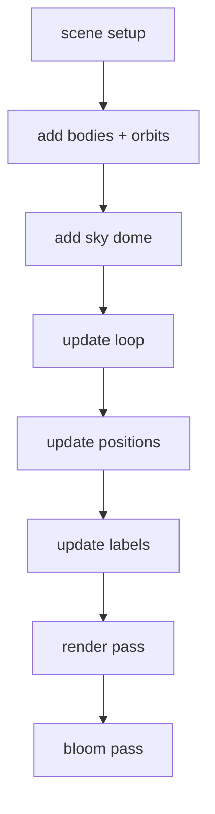

# Low-level Design: Rendering Pipeline

## Solar System pipeline

## Shaders

- Orbit rendering uses a custom shader with a uniform that highlights the current mean anomaly.
- Atmosphere uses a custom shader with camera and sun direction uniforms.

## Post-processing

- `EffectComposer` + `RenderPass` + `UnrealBloomPass`.
- Bloom is configurable via the settings panel.

## Texture loading

- Basis textures are loaded per body when the camera is within range.
- Meshes and textures are disposed when far away to reduce memory usage.
