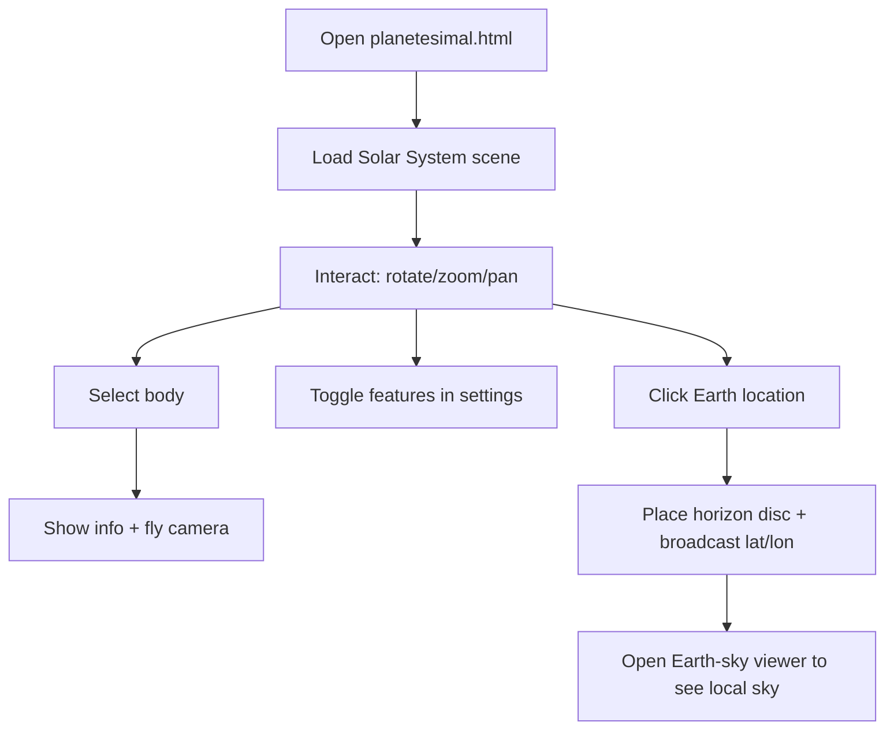

# Project Overview

## What this is

Planetesimal is a self-contained, client-side web application that renders a real-time 3D Solar System simulation and an optional Earth-based night-sky viewer. The core is a Three.js scene that draws planets, moons, orbits, sky dome, and optional constellations, with time controls and object interaction.

Two major experiences are included:

- **Solar System simulation** (Planetesimal) - 3D bodies, orbits, labels, camera controls, time dilation.
- **Earth-sky viewer** (night sky) - observer-based sky dome with stars, constellations, Sun/Moon/planets using RA/Dec and Alt/Az.

## Key goals

- Provide a visually intuitive view of orbital motion and planetary alignment.
- Correlate a clicked Earth location to the sky that would be seen from that point.
- Keep everything client-only with no build step.

## Primary user flows

## Core components

- `planetesimal.html` - entry point for the Solar System scene
- `scripting.js` - main scene setup, update loop, UI, interactions
- `functions.js` - orbital and coordinate math
- `construction.js` - data tables for bodies
- `planet.js` / `moon.js` - runtime objects and mesh updates
- `nightsky/earth-sky/*` - Earth-based sky viewer and astronomy calculations

## Non-goals (current scope)

- No server-side processing.
- No high-precision ephemeris or N-body integration.
- No build pipeline (ES modules are loaded directly in the browser).
