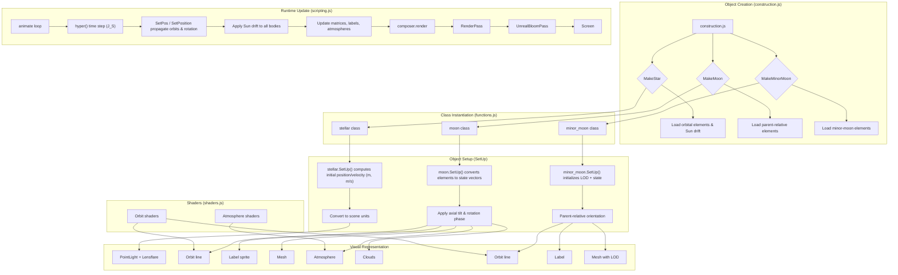

# Celestial Object Diagram & Implementation Details

## Status Update (2026-01-01)

This diagram remains broadly accurate for the Solar System simulation pipeline.

Current notes:
- Earth axial tilt uses a fixed mean obliquity constant.
- The Earth horizon disc now uses a stable tangent-plane basis (North/East/Up) instead of a pure lookAt orientation.

## Initialization and Update Notes

- **Initial position/velocity:** Each body reads analytic orbital elements (semi-major axis, eccentricity, inclination, argument of periapsis, longitude of ascending node, mean anomaly/epoch) in `construction.js`, converts them to state vectors in meters and m/s inside `MakeStar` / `MakeMoon` / `MakeMinorMoon`, and passes them into the class constructors.
- **Reference frames:** Parent-child chaining is used; moons and minor moons are relative to the parent planet, and the star (Sun) is the top-level frame. All distances are scaled to scene units (1 unit = 1e7 m) before meshes are placed.
- **Orientation:** `SetUp()` computes axial tilt, rotation rate, and initial spin phase so meshes, atmospheres, and cloud layers start aligned to their ephemeris at t0.
- **Time source:** `hyper()` in `scripting.js` computes simulated seconds (`J_S`) from the UI-controlled speed multiplier and uses it for every update.
- **Integration:** `SetPos` / `SetPosition` advance each body with simple propagation (Keplerian updates plus rotation increments) using `J_S`. Velocities stay in SI; positions are rescaled back to scene units for rendering.
- **System drift:** The Sun carries a linear galactic drift (~230 km/s). Planets/moons inherit that translation in `planet.js:46`, keeping the whole system coherent as the star moves.
- **Rendering:** After transforms, `composer.render` runs the render pipeline (RenderPass -> UnrealBloomPass) every frame.

## Object Creation Phase (construction.js)

Each celestial body is exported from `construction.js` via factory functions:

### `MakeStar(options)` - Creates a `stellar` class instance (Sun)

- Sets: `mass` (1.98847e30 kg), initial position (ecliptic [0,0,0]), color based on temperature (5778K -> whitish)
- Configures: `luminosity`, lens flare intensity, point light properties
- Initialization flag: `_prevJS = null` to avoid NaN in first velocity update
- Example:
  ```javascript
  export var sol = MakeStar({
      name: "sun",
      position: [0, 0, 0],
      mass: 1.98847e30,
      color: "rgb(255, 247, 200)"
  });
  ```

### `MakeMoon(options)` - Creates a `moon` class instance (planets & major moons)

- **Parent reference:** `sol` (heliocentric) or another moon (e.g., Earth for Moon)
- **Orbital elements:** 
  - Semi-major axis `a` (AU)
  - Eccentricity `e` (unitless, 0  e < 1)
  - Inclination `i` (deg, angle to ecliptic plane)
  - Argument of periapsis `` (deg, angle in orbit plane)
  - Longitude of ascending node `` (deg, angle to ecliptic reference)
  - Mean anomaly `M` (deg, angular position at J2000.0 epoch)
- **Physical data:** Equatorial radius, polar radius, atmosphere height, axial tilt (RA/Dec of north pole), rotation period, temperature, mass, bump map scale
- **Flags:** `majorLabel` (always visible), `cloudy` (render cloud layer), `tidalLock` (rotates to face parent)
- Example:
  ```javascript
  export var earth = MakeMoon({
      name: "earth",
      parent: sol,
      color: "rgb(131, 151, 201)",
      majorLabel: true,
      cloudy: true,
      Data: [e, 0, i, , , 0, 0, M, 0, a_AU, 0, T_seconds, ...],
      Physical: [r_eq, r_pol, T_rot, h_atm, dec, ra, mass, bump_scale]
  });
  ```

### `MakeMinorMoon(options)` - Creates a `minor_moon` class instance (dwarf planets, asteroids)

- Similar to `MakeMoon` but with reduced LOD (level of detail) meshes for distant rendering
- Includes flags: `dwarfPlanet`, `barycenter`, `majorLabel`
- Used for: Pluto, Charon, asteroid belt bodies, Earth-Moon barycenters
- Example:
  ```javascript
  export var pluto_barycenter = MakeMinorMoon({
      parent: sol,
      name: "pluto barycenter",
      barycenter: true,
      Data: [...],
      Physical: [...]
  });
  ```

## Orbital Element Conversion (functions.js: `vector()` function)

The core orbital propagation uses **Keplerian mechanics** to convert from orbital elements to Cartesian state vectors:

### Inputs
```
M     - Parent body mass (kg)
a     - Semi-major axis (m, stored as 1000 x AU in Data[9])
e     - Eccentricity (unitless)
i     - Inclination (radians, converted from degrees in Data[2])
     - Argument of periapsis (radians, from Data[4])
     - Longitude of ascending node (radians, from Data[3])
M    - Mean anomaly (radians, updated each frame via CurrentMa())
```

### Process: Kepler's Equation Solver

1. **Compute gravitational parameter:**
   ```
    = G x M = 6.67408e-11 x parent_mass
   n = (/a)  - mean motion (rad/s)
   ```

2. **Solve eccentric anomaly iteratively** (Newton-Raphson, ~6 iterations):
   ```
   E = (E - esin(E) - M) / (1 - ecos(E))
   E_new = E - E
   (repeat until |E| < 1e-12)
   ```

3. **Calculate 2D position in orbital plane:**
   ```
   x_w = a(cos(E) - e)
   y_w = bsin(E)    where b = a(1-e)
   r_w = a(1 - ecos(E))  - distance from focus
   ```

4. **Calculate 2D velocity in orbital plane:**
   ```
    = (/a) / r_w = (/a) / (a(1 - ecos(E)))
   _w = -asin(E)
   _w = bcos(E)
   ```

5. **Rotate from orbital frame to ecliptic frame** using 3D rotation matrices:
   ```
   [r_ecl]     [r_w]
   [v_ecl]  =  P(, , i) x  [v_w]
   
   Where P is the product of three rotation matrices:
   - P(): rotation about Z by longitude of ascending node
   - P(i): rotation about new X by inclination
   - P(): rotation about new Z by argument of periapsis
   ```

### Output
```
Vector3D: [x_ecl, y_ecl, z_ecl, _ecl, _ecl, _ecl, ]
where  is the true anomaly (used for orbit line highlighting)
```

### Mean Anomaly Update (CurrentMa function)

Every frame, the mean anomaly advances according to **Kepler's Second Law**:
```javascript
function CurrentMa(m0_deg, mass, sma, epoch, time) {
    // Convert initial mean anomaly from degrees to radians
    m0_rad = DegToRad(m0_deg);
    
    // Mean motion: average angular velocity (rad/s)
    n = Math.sqrt((6.67408e-11 * mass) / (sma * sma * sma));
    
    // Current mean anomaly = initial + n x t
    return m0_rad + n * (time - epoch);
}
```

For **binary systems** (e.g., Pluto-Charon), special handling computes both bodies' positions relative to their common barycenter using reduced mass.

## Class Initialization

### `moon.SetUp()` 

Called once during object construction:

1. **Build orbit geometry** via `MakeOrbit_2(Data, color)`:
   - Creates `THREE.EllipseCurve(cx, cy, a_scene, b_scene, rotation, theta_start, theta_end, steps)`
   - Converts physical orbit (semi-major axis, eccentricity) to ellipse with proper center offset and orientation
   - Wraps in `THREE.BufferGeometry().setFromPoints(points)` with 256+ vertices
   - Applies custom `ShaderMaterial` with uniforms:
     - `MA` (float): current true anomaly for position highlight
     - `colorA` (vec3): body's primary color
   - Uses `vertexShader()` to project orbit to ecliptic plane
   - Uses `fragmentShader()` to fade from color at current position -> black along rest of orbit

2. **Create text sprite label:**
   - Renders text to 100x100 canvas (white Arial, size 48)
   - Creates `THREE.CanvasTexture` and `THREE.SpriteMaterial`
   - Sets `depthTest: false` and `sizeAttenuation: false` (always screen-sized)
   - Registers in scene with label group

3. **Register in raycasting arrays:**
   - Adds mesh to `Castable` (always clickable)
   - If `majorLabel === true`, also adds to `major_castable` (visible at far distances only)

4. **Position setup:**
   - Calls `SetPos()` to compute initial heliocentric position
   - Converts to scene units (divideScalar(10000000))
   - Adds parent position for absolute placement

### `moon.SetMesh()`

Creates and applies 3D geometry and materials:

#### Geometry
```javascript
const geometry = new THREE.SphereGeometry(
    radius_m / 20000000,  // Radius in scene units
    segmentsWidth,        // Typically 100 for near, 4 for far
    segmentsHeight        // Typically 200 for near, 2 for far
);
```

#### Material - `THREE.MeshPhongMaterial` with textures

- **Base color texture:** `textures/{name}.basis`
  - Loaded asynchronously via `basisLoader`
  - GPU-transcoded from Basis format to GPU-native (BC7, ETC1, etc.)
  - Applied to `map` uniform

- **Bump map:** `textures/{name}_bump.basis`
  - Loaded to `bumpMap` uniform
  - `bumpScale = physical[7] / 50000000` (typically 0.1-1.0 for surface detail)
  - Multiplied with normal in fragment shader

- **Displacement map:** Same bump texture
  - Applied to `displacementMap` with scale `physical[7] / 50000000`
  - Modulates vertex positions in vertex shader for subtle 3D relief

- **Specular map:** `textures/{name}_spec.basis`
  - Applied to `specularMap` uniform
  - Controls which regions are shiny (water) vs matte (land)
  - `shininess = 50` (moderate gloss)

- **Cloud layer:** `textures/{name}_clouds.basis` (if `cloudy === true`)
  - Separate sphere at `radius + atmosphere_height`
  - `MeshPhongMaterial` with `alphaMap` for cloud transparency
  - Rotates at constant angular velocity in `SetPosition()`
  - Blended over base sphere via `THREE.Depth` or opacity blending

#### Atmosphere (if `physical[3] > 0`)

- Creates second sphere with radius = `physical[0] / 20000000 + physical[3] / 50000000`
- Uses **custom `ShaderMaterial`** with rim lighting:
  - **Vertex shader:**
    - Applies flattening for oblate spheroids (/2 - atan(sqrt(1-e)tan(lat)))
    - Computes vertex normal and passes to fragment
  - **Fragment shader:**
    - Computes angle between fragment normal and camera direction
    - Evaluates **Fresnel approximation:** `F = sin(angle)^density`
    - Dark at center (looking straight down), bright at limb (grazing angle)
    - Adds sun reflection: `max(0, dot(normal, sun_direction))^8 x sun_color`
    - Output: `vec4(colorA x F + reflection, F)` (bright glow at terminator)

## Reference Frames & Positioning

### Parent-Child Transform Chain

```
solar_system (root)
 Sun (stellar) @ ecliptic origin [0, 0, 0]
    Mercury (moon) @ heliocentric position
    Venus (moon) @ heliocentric position
    Earth (moon) @ heliocentric position
       Moon (moon) @ geocentric (relative to Earth.Position)
    Mars (moon) @ heliocentric position
    Jupiter (moon) @ heliocentric position
       Io (moon) @ Jovicentric position
       Europa (moon) @ Jovicentric position
       Ganymede (moon) @ Jovicentric position
       Callisto (moon) @ Jovicentric position
    Saturn (moon) @ heliocentric position
       Titan (moon) @ Saturnian position
       Rhea (moon) @ Saturnian position
       [...other moons]
    Uranus (moon) @ heliocentric position
    Neptune (moon) @ heliocentric position
    Pluto barycenter (minor_moon, binary) @ heliocentric position
        Charon (moon) @ barycentric (relative to Pluto)
 Asteroid cloud (Points) @ heliocentric positions
```

### Coordinate Transform

Each body's `SetPos()` computes Keplerian state vector in **SI units** (meters, m/s), then `SetPosition()` transforms to **scene coordinates**:

```javascript
// In SetPos():
var pos = vector(parent_mass, sma, e, i, , , M(t));
// pos = [x_m, y_m, z_m, vx, vy, vz, ]  in meters & m/s

// In SetPosition():
this.Position = new THREE.Vector3(pos[0], pos[2], -pos[1]);
this.Position.divideScalar(10000000);      // m -> scene units (1 unit = 1e7 m)
this.Position.add(this.parent.Position);   // Parent-relative -> absolute in scene

this.Velocity = new THREE.Vector3(pos[3], pos[5], -pos[4]);  // m/s
this.Velocity.add(this.parent.Velocity);   // Inherit parent velocity
```

**Coordinate system:** X (ecliptic), Y (up/north), Z (toward vernal equinox, negated for left-hand render)

### Axial Orientation & Rotation

#### Fixed Rotation (RA/Dec -> Ecliptic)

The `CelestialToEcliptic(declination, rightAscension)` function applies a fixed rotation matrix corresponding to Earth's mean obliquity (~23.439deg):

```javascript
function CelestialToEcliptic(dec, ra) {
    // Converts from celestial equatorial (RA/Dec) to ecliptic coordinates
    // Returns [rotation_y_radians, rotation_z_radians] for mesh.rotateY/Z
    const  = 23.439 * Math.PI / 180;  // Mean obliquity
    return [
        ra,
        -Math.atan2(Math.cos(ra) * Math.sin(), 1)
    ];
}
```

Applied at mesh creation:
```javascript
var rot = CelestialToEcliptic(
    DegToRad(Physical[5]),  // RA of north pole (degrees)
    DegToRad(Physical[4])   // Dec of north pole (degrees)
);
this.Mesh.rotateY(rot[0]);
this.Mesh.rotateZ(rot[1]);
```

#### Continuous Rotation (Spin)

Each frame in `SetPosition()`:

```javascript
if (this.tidalLock) {
    // Always face parent body
    this.Mesh.lookAt(this.parent.Position);
    this.Mesh.rotateY(-Math.PI / 2);
} else {
    // Spin about axis at rate T_rot (rotation period in seconds)
    const spin_angle = time_rate * 2 * Math.PI * 0.02 / Physical[2];
    this.Mesh.rotateY(spin_angle);
}
```

**Cloud rotation:** Applied independently if `cloudy === true`:
```javascript
if (this.cloudy) {
    const cloud_spin = time_rate * 2 * Math.PI * 0.0175 / Physical[2];
    this.clouds.rotateY(cloud_spin);  // Faster rotation for atmosphere
}
```

## Runtime Update Cycle

### Time Computation (scripting.js: `onTimerTick()` -> `update()`)

Called via `setInterval(onTimerTick, 16)` (~60 FPS, but decoupled from render):

```javascript
var d = new Date();
var utc_day = d.getTime() / 86400000;                    // Days since epoch (UTC)
var time_jd = utc_day + 2440587.5 + 37.184/86400;        // Julian Day (includes leap seconds)
var J_D = (time_jd - 2451545);                           // Days since J2000.0 epoch (noon UTC, 2000-01-01)

var dt = (nowMs - _lastUpdateMs) / 1000;                 // Real-world seconds elapsed

if (!paused) {
    time_mod += ((time_rate - 1) * dt) / 86400;          // Accumulated time offset (days)
}

J_D = time + time_mod;                                   // Julian Day (with simulation offset)
J_C = J_D / 36525;                                       // Julian Century (36525 days)
J_S = J_D * 86400;                                       // Julian Seconds (seconds since J2000.0)
```

### Time Rate Controls (UI & Keyboard)

- **Slider:** Discrete rates: 1 s/s (real-time), 10 s/s, 60 s/s, 300 s/s, 1 day/s, 10 day/s, 100 day/s, 365 day/s, 3650 day/s
- **Accelerate:** `,` key -> `time_rate *= 1.2` (or 1.05 for large values)
- **Decelerate:** `.` key -> `time_rate *= 0.8`
- **Reverse:** `/` key -> `time_rate *= -1` (enables backward simulation)
- **Pause:** `K` key -> `paused = !paused` (freezes `time_mod`, keeping current J_D fixed)

### Animation Loop (scripting.js: `animate()`)

Executed every browser frame via `renderer.setAnimationLoop(animate)` (~60 FPS):

```
1. Render frame:
   if (post_processing) {
       composer.render();  // RenderPass -> UnrealBloomPass (bloom effect)
   } else {
       renderer.render(scene, camera);
   }

2. Update camera:
   controls.update();              // TrackballControls damping & momentum
   sky.position.copy(camera.position);  // Sky sphere follows camera (always centered)

3. If sim_run == true:
   hyper();                        // Advance physics
   updateConstellationLabels();    // Update label positions & visibilities
   controls.enabled = true;        // Allow user interaction
```

### Physics Update (scripting.js: `hyper()`)

Main simulation tick, called from `animate()` loop:

```javascript
function hyper() {
    // 1. Propagate all celestial bodies
    for (let body of moons) {
        body.SetPos();              // Compute new state vector using J_S
    }
    for (let star of stars) {
        star.update();              // Apply galactic drift
    }

    // 2. Update procedural bodies
    updateCloud();                  // Recompute asteroid cloud positions
    updateSatelliteCloud();         // Recompute Earth satellite positions

    // 3. Update camera tracking
    if (camera_following_body) {
        const delta = target.Position - target.Position_prev;
        camera.position.add(delta);  // Lock camera to body motion
    }

    // 4. Update render parameters
    // - Time acceleration/deceleration (buttons or keys)
    // - Camera FOV changes (L/R keys)
    // - Bloom strength changes (U/D keys)
    // - Ring position tracking (Saturn)
    // - Label scaling (distance-based)

    // 5. Update visual representations
    for (let body of moons) {
        body.SetPosition();          // Position mesh, load/unload LOD
    }

    // 6. Update info panel display
    // - Target body name, position (KM from origin), orbital elements
    // - Camera position & distance from target
    // - Simulated time (formatted as YYYY:MM:DD:HH:MM:SS)
    // - Time rate & acceleration
}
```

### Orbital Position Update (moon.SetPos)

For each non-binary moon:

```javascript
moon.SetPos = function() {
    // Retrieve orbital elements from this.Data
    var pos = vector(
        this.parent.Physical[6],       // Parent mass (kg)
        1000 * this.Data[9],           // Semi-major axis (m)
        this.Data[0],                  // Eccentricity
        DegToRad(this.Data[2]),        // Inclination
        DegToRad(this.Data[4]),        // Argument of periapsis
        DegToRad(this.Data[3]),        // Longitude of ascending node
        CurrentMa(                     // Current mean anomaly
            this.Data[7],              // Initial mean anomaly (deg)
            this.parent.Physical[6],   // Parent mass
            1000 * this.Data[9],       // Semi-major axis (m)
            0,                         // Epoch (J2000.0 reference)
            J_S                        // Simulated seconds
        )
    );

    // pos = [x_m, y_m, z_m, vx, vy, vz, _true]

    // Convert to scene units and add parent position
    this.Position = new THREE.Vector3(pos[0], pos[2], -pos[1]);
    this.Position.divideScalar(10000000);
    this.Position.add(this.parent.Position);

    this.Velocity = new THREE.Vector3(pos[3], pos[5], -pos[4]);
    this.Velocity.add(this.parent.Velocity);

    this.trueAnomaly = pos[6];  // For orbit glow shader
};
```

**Mean Anomaly Update:**
```javascript
function CurrentMa(m0, parent_mass, sma, epoch, time) {
    const m0_rad = DegToRad(m0);
    const mu = 6.67408e-11 * parent_mass;
    const n = Math.sqrt(mu / (sma * sma * sma));  // Mean motion (rad/s)
    return m0_rad + n * (time - epoch);
}
```

### Mesh & Label Updates (moon.SetPosition)

Distance-based visibility and level-of-detail loading:

```javascript
moon.SetPosition = function() {
    const h = camera.getEffectiveFOV() / 50;     // FOV scale factor
    const dist = camera.position.distanceTo(this.Position);

    // Label visibility decision
    if (this.majorLabel == false) {
        if (dist > 30000 / h) {
            this.label.visible = false;
        } else if (labels_visible && moons_visible) {
            this.label.visible = true;
        }
    }
    // Scale label based on distance
    this.label.scale.set(0.08 * h, 0.08 * h);
    this.label.position.copy(this.Position);

    // Lazy texture loading
    if (!this.loaded && dist < this.Physical[0] / (50000 * h)) {
        if (!this.initiated) {
            this.SetMesh();  // Create geometry with current LOD
        }
        // Load textures asynchronously
        basisLoader.load('textures/' + this.name + '.basis',
            (tex) => {
                this.Mesh.material.map = tex;
                this.Mesh.material.needsUpdate = true;
            }
        );
        // ... load bump, spec, cloud textures similarly
        this.loaded = true;
    }

    // Unload at far distance (prevent memory bloat)
    if (this.loaded && dist > 100000) {
        this.Mesh.geometry.dispose();
        this.Mesh.material.dispose();
        // ... dispose cloud & atmosphere
        this.loaded = false;
    }

    // Position mesh in scene
    this.Mesh.position.copy(this.Position);

    // Rotate mesh based on spin or tidal lock
    if (this.cloudy) {
        const cloud_spin = time_rate * 2 * Math.PI * 0.0175 / this.Physical[2];
        this.clouds.rotateY(cloud_spin);
    }

    if (this.tidalLock) {
        this.Mesh.lookAt(this.parent.Position);
        this.Mesh.rotateY(-Math.PI / 2);
    } else {
        const spin = time_rate * 2 * Math.PI * 0.02 / this.Physical[2];
        this.Mesh.rotateY(spin);
    }

    // Update atmosphere shader uniforms
    if (this.atmosphere) {
        this.atmosphere.material.uniforms.sunPos.value.copy(sol.Position);
        this.atmosphere.material.uniforms.camPos.value.copy(camera.position);
        this.atmosphere.material.uniforms.MA.value = this.trueAnomaly;
    }
};
```

### Sun Galactic Drift (stellar.update)

Linear velocity integration representing the Sun's motion around the Milky Way:

```javascript
stellar.update = function() {
    if (this._prevJS === null) {
        this._prevJS = J_S;
        return;
    }

    // Time step in simulated seconds
    const deltaS = J_S - this._prevJS;

    // Convert to scene units (1 unit = 1e7 m)
    const dScene = deltaS / 10000000;

    // Advance position using galactic velocity
    // this.Velocity = [230000, 0, 0] m/s (motion around Milky Way)
    this.Position.addScaledVector(this.Velocity, dScene);

    // All child bodies (planets/moons) inherit parent.Position in SetPos(),
    // so entire Solar System translates coherently
    this._prevJS = J_S;
};
```

**Reference parameters:**
- **Galactocentric radius:** R  8.2 kpc  2.53x10 m
- **Circular speed:** v  230 km/s (230,000 m/s) near the Local Standard of Rest
- **Orbital period:** T  220 Myr (time to complete galactic orbit)
- **Simulation approach:** Local **linear drift** (not full circular orbit) suitable for timescales < 1 Myr

## Geometry & Rendering

### Orbit Line Rendering (functions.js: MakeOrbit_2)

Creates `THREE.LineSegments` with procedural geometry and custom shaders:

```javascript
function MakeOrbit_2(data, color) {
    // data = [a (AU), e, i, , , ...]
    
    // Convert to scene units and compute ellipse geometry
    const a_AU = data[0];
    const e = data[9];  // Eccentricity
    const a_scene = a_AU / 10;  // Scale down for rendering
    const b_scene = a_scene * Math.sqrt(1 - e * e);  // Semi-minor axis
    
    // Create ellipse curve with 256+ vertices
    const ellipse = new THREE.EllipseCurve(0, 0, a_scene, b_scene, 0, 2*Math.PI, 256);
    const points = ellipse.getPoints(256);
    
    // Build buffer geometry
    const geometry = new THREE.BufferGeometry().setFromPoints(points);
    
    // Custom shader material
    const material = new THREE.ShaderMaterial({
        uniforms: {
            MA: { type: 'float', value: 0.0 },      // Current true anomaly
            colorA: { type: 'vec3', value: color }  // Body color
        },
        vertexShader: `
            uniform float MA;
            varying float vDist;
            
            void main() {
                vec3 pos = position;
                // Project to ecliptic plane
                gl_Position = projectionMatrix * modelViewMatrix * vec4(pos, 1.0);
                
                // Compute angular distance to current position
                vDist = distance(atan(pos.y, pos.x), MA);
            }
        `,
        fragmentShader: `
            uniform vec3 colorA;
            varying float vDist;
            
            void main() {
                // Highlight region near true anomaly (+/-0.1 rad)
                float intensity = exp(-vDist * vDist / 0.02);
                gl_FragColor = vec4(colorA * intensity, 1.0);
            }
        `
    });
    
    const line = new THREE.LineSegments(geometry, material);
    return line;
}
```

The orbit shader highlights the body's current position (true anomaly ):
- Fragment shader evaluates distance to position vertex
- Fades from `colorA` (body color) -> black along rest of orbit
- Provides visual feedback on current location in orbital period

### Atmosphere Rendering (shaders.js)

Custom atmosphere shader with rim lighting and Fresnel effect:

```glsl
// vertexShader
uniform vec3 colorA;

varying vec3 vNormal;
varying vec3 vPos;
varying float vDist;

void main() {
    // Flatten oblate spheroid (if needed for planets like Saturn)
    vec3 pos = position;
    float lat = asin(pos.y / length(pos));
    float flatness = 1.0 - 0.1 * sin(lat * lat);
    pos *= flatness;
    
    vNormal = normalize(normalMatrix * normal);
    vPos = (modelViewMatrix * vec4(pos, 1.0)).xyz;
    gl_Position = projectionMatrix * vec4(vPos, 1.0);
}

// fragmentShader
uniform vec3 colorA;
uniform vec3 sunPos;
uniform vec3 camPos;

varying vec3 vNormal;
varying vec3 vPos;

void main() {
    vec3 viewDir = normalize(camPos - vPos);
    vec3 sunDir = normalize(sunPos - vPos);
    
    // Fresnel effect: bright at grazing angle, dark at normal incidence
    float fresnel = pow(sin(acos(abs(dot(vNormal, viewDir)))), 2.0);
    
    // Sun reflection
    float sunReflect = max(0.0, dot(vNormal, sunDir));
    sunReflect = pow(sunReflect, 8.0);  // Sharp reflection
    
    // Combine
    vec3 color = colorA * fresnel + vec3(1.0) * sunReflect;
    gl_FragColor = vec4(color, fresnel);
}
```

**Key features:**
- Rim lighting: bright at terminator (day/night boundary)
- Fresnel blending: glow effect visible from all angles
- Sun reflection: realistic specular highlight
- Alpha blending: atmosphere transparently overlays planet

### Post-Processing Pipeline (EffectComposer.js)

Full rendering pipeline with bloom effect:

```javascript
function renderFrame() {
    if (post_processing) {
        // Pass 1: Render scene to intermediate buffer
        composer.passes[0] = new RenderPass(scene, camera);
        
        // Pass 2: Extract bright regions and blur
        composer.passes[1] = new UnrealBloomPass(
            new THREE.Vector2(window.innerWidth, window.innerHeight),
            1.5,    // Strength
            0.4,    // Radius
            0.85    // Threshold
        );
        
        // Composite and output to canvas
        composer.render();
    } else {
        renderer.render(scene, camera);
    }
}
```

**UnrealBloomPass settings:**
- **Strength:** 0-10 (UI slider for bloom intensity)
- **Radius:** Auto-adjusted by camera distance from target
- **Threshold:** 0.0 (all pixels contribute to bloom)
- **Auto-exposure:** Tied to camera distance (dim when zoomed in, bright when far)

---

## Raycasting & Interaction

### Click-to-Focus (scripting.js: `click()`)

Implements single-click focus on celestial bodies:

```javascript
function click(event) {
    // Normalized mouse coordinates [-1, 1]
    mouse.x = (event.clientX / window.innerWidth) * 2 - 1;
    mouse.y = -(event.clientY / window.innerHeight) * 2 + 1;
    
    // Raycast from camera through mouse position
    raycaster.setFromCamera(mouse, camera);
    
    // Distance-based raycast selection
    let intersects;
    if (camera.position.distanceTo(target.Position) > 30000) {
        // Far away: only check majorLabel objects (visible at distance)
        intersects = raycaster.intersectObjects(major_castable);
    } else {
        // Close up: check all bodies
        intersects = raycaster.intersectObjects(Castable);
    }
    
    if (intersects.length > 0) {
        GoTo(intersects[0].object.owner);
    }
}
```

### Hover Cursor Feedback (onMouseMove)

Provides visual feedback when cursor is over clickable objects:

```javascript
function onMouseMove(event) {
    mouse.x = (event.clientX / window.innerWidth) * 2 - 1;
    mouse.y = -(event.clientY / window.innerHeight) * 2 + 1;
    
    raycaster.setFromCamera(mouse, camera);
    const intersects = raycaster.intersectObjects(Castable);
    
    // Change cursor style
    renderer.domElement.style.cursor = (intersects.length > 0)
        ? 'pointer'      // Over clickable object
        : 'default';     // Empty space
}
```

### GoTo Animation

Implements damped camera motion to focus on selected body:

```javascript
var target_object = null;
var travelling = false;

function GoTo(object) {
    target_object = object;
    travelling = true;
    controls.target.copy(object.Position);
}

// In hyper() loop:
if (travelling) {
    const rel = target_object.Position.clone()
        .sub(camera.position);
    
    if (rel.length() < controls.minDistance * 2) {
        travelling = false;  // Arrival condition
    }
    
    // Smooth approach (exponential damping)
    rel.divideScalar(10);
    camera.position.add(rel);
}
```

**Animation characteristics:**
- Duration: ~1 second for typical distances
- Acceleration: Exponential damping (1/10 factor per frame)
- Arrival condition: Within 2x camera minimum distance
- Interruptible: User can restart animation or use other camera controls

---

## Data Structures

### Body Data Array (moon.Data)

Orbital and physical parameters stored in a single array:

```javascript
Data = [
    0:  eccentricity (e)                  // 0  e < 1
    1:  (reserved)
    2:  inclination (degrees)             // Angle to ecliptic plane
    3:  longitude of ascending node ()   // Degrees
    4:  argument of periapsis ()         // Degrees
    5:  (reserved)
    6:  (reserved)
    7:  mean anomaly at epoch (M)        // Degrees at J2000.0
    8:  (reserved)
    9:  semi-major axis (AU)              // Semi-major axis
    10: (reserved)
    11: orbital period (seconds)          // P = 2(a/)
    12-14: (reserved)
]
```

### Physical Data Array (moon.Physical)

Body's physical and rotational properties:

```javascript
Physical = [
    0: equatorial radius (m)              // Radius at equator (r_eq)
    1: polar radius (m)                   // Radius at poles (r_pol, flattened)
    2: rotation period (seconds)          // Sidereal day
    3: atmosphere scale height (m)        // For atmosphere rendering
    4: declination of north pole (deg)    // Equatorial declination (Dec)
    5: right ascension of north pole (deg) // Equatorial RA
    6: mass (kg)                          // Body mass
    7: bump/displacement scale (m)        // For surface detail
]
```

---

## Performance Optimizations

### 1. Level of Detail (LOD)

Distance-based mesh complexity:

```javascript
// Far bodies (distance > 30,000 scene units)
const far_segments_w = 2 * LOD_factor;    // e.g., 4 segments
const far_segments_h = LOD_factor;        // e.g., 2 segments
const far_geo = new THREE.SphereGeometry(radius, far_segments_w, far_segments_h);

// Near bodies (distance < 30,000 scene units)
const near_segments_w = 100;              // High fidelity
const near_segments_h = 200;
const near_geo = new THREE.SphereGeometry(radius, near_segments_w, near_segments_h);

// Load/unload based on distance
if (dist < Physical[0] / (50000 * h)) {
    LoadMesh(near_geo);  // High LOD when close
} else if (dist > 100000) {
    UnloadMesh();        // Unload when very far
}
```

### 2. Lazy Texture Loading

Asynchronous Basis format transcoding:

```javascript
const basisLoader = new BasisTextureLoader();

if (dist < loadingDistance) {
    if (!this.loaded) {
        basisLoader.load('textures/' + this.name + '.basis',
            (texture) => {
                this.Mesh.material.map = texture;
                this.Mesh.material.needsUpdate = true;
                this.loaded = true;
            }
        );
    }
}

// Unload at distance to reclaim VRAM
if (dist > 100000 && this.loaded) {
    texture.dispose();
    this.loaded = false;
}
```

### 3. Frustum Culling

Disable culling for globally-visible objects:

```javascript
constellationGroup.frustumCulled = false;     // 2D constellation lines
asteroidCloudPoints.frustumCulled = false;    // Procedural asteroid belt
skyBox.frustumCulled = false;                 // Sky sphere always rendered
```

### 4. Cached Orbital Propagation

Pre-computed rotation matrices for minor bodies:

```javascript
// Stored in test[2-8]
test[2] = cos(),  test[3] = sin();  // Rotation about Z
test[4] = cos(i),  test[5] = sin(i);  // Rotation about X
test[6] = cos(),  test[7] = sin();  // Rotation about Z

// Fast path with 2 Newton iterations instead of 6
function vector_opt_2(mass, a, e, i, , , M) {
    // ... optimized Kepler solver
}
```

### 5. Label Fade

Distance-based opacity for constellation and body labels:

```javascript
const fadeRange = 0.7 * maxDistance;
const fadeStart = 0.15 * maxDistance;
const opacity = Math.min(1.0, Math.max(0.05, (dist - fadeStart) / fadeRange));

label.material.opacity = opacity;
```

---



