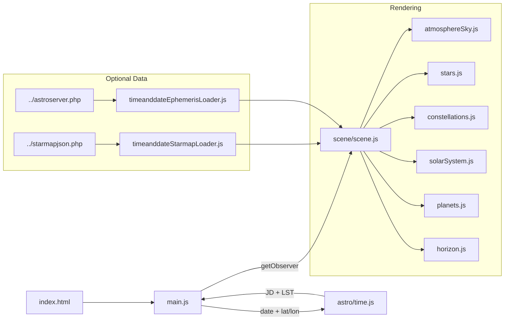
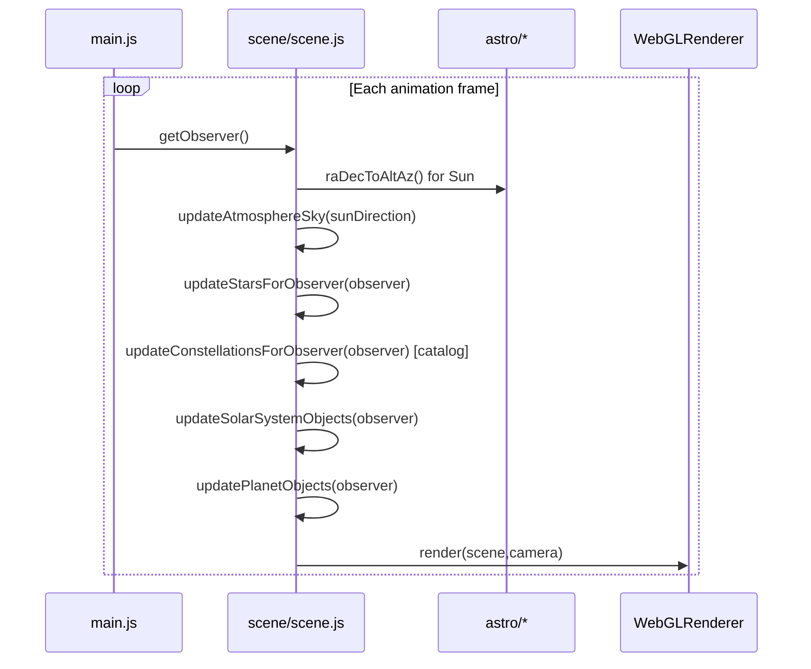
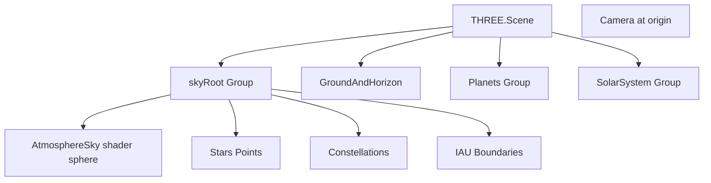

# Earth Sky / Night Sky Viewer - Design & Implementation

## Status Update (2026-01-01)

This design doc still matches the current Earth-sky viewer. The active entry point is `nightsky/earth-sky/index.html`.

Applies to: `earth-sky/` (Three.js viewer)

This document describes the implementation at the "wires and math" level: what data is ingested (including the Timeanddate datasets you sync into this repo), how astronomical coordinates are computed, how those coordinates are transformed into Three.js positions, and how rendering + picking are updated per frame.

---

## 1) Quick start (mental model)

- `earth-sky/index.html` defines the UI and the `<canvas id="skyCanvas">` render target.
- `earth-sky/main.js` reads UI state (date/time, latitude/longitude), computes an **observer snapshot**, and exposes it to the renderer via `sky.getObserver()`.
- `earth-sky/scene/scene.js` builds the Three.js scene graph and drives the per-frame update loop:
  - updates sky background (atmosphere shader) from Sun direction,
  - updates stars (twinkle, daylight fade, extinction; optional horizon reprojection),
  - updates constellations (optional horizon reprojection from catalog edges),
  - updates Sun/Moon/planets (billboard point sprites),
  - handles selection/picking + HUD.

---

## 2) Inputs (what the viewer expects)

### 2.1 User inputs (UI)

All astronomy is derived from:

- **Date/time**: a local "datetime-local" value (internally stored in `input#dt` and synced with the date + time slider UI).
- **Observer latitude**: degrees, **north-positive**.
- **Observer longitude**: degrees, **east-positive** (West longitudes are negative).
- **Catalog mode** (optional): query param or localStorage (see 8.3).
- **Focus object** (optional): "sun / moon / venus / ..." (used for camera targeting and "force visible" behavior).

### 2.2 Dataset inputs (synced from Timeanddate)

This project is wired to load your locally saved copies:

- `../starmapjson.php` (stars + stick-figure constellation edges)
- `../astroserver.php` (ephemeris polynomials for Sun/Moon/planets)

The original source endpoints (examples) are Timeanddate scripts, e.g.:

- `https://www.timeanddate.com/scripts/starmapjson.php?mag_min=5.5&mag_max=-27&v=1.1`
- `https://www.timeanddate.com/scripts/astroserver.php?mode=planetsstarmapnight&n=...&year=...&month=...&day=...&v=0.75&fullday=1&eclipseevents=1&eclipseevents=1&planetsevents=1`

The viewer does **not** call these remote URLs directly; it fetches the local files by default to avoid network dependency and keep repeatable results.

---

## 3) Repository layout (key files)

**Entry points**
- `earth-sky/index.html` - UI + canvas.
- `earth-sky/main.js` - UI logic + observer snapshot provider.

**Astronomy/math**
- `earth-sky/astro/time.js` - Julian Date + GMST/LST.
- `earth-sky/astro/coordinates.js` - RA/Dec -> Alt/Az + `altAzToVector3()` (includes refraction).
- `earth-sky/astro/extinction.js` - atmospheric extinction (magnitude dimming near horizon).
- `earth-sky/astro/solarSystem.js` - fallback Sun/Moon RA/Dec approximations.
- `earth-sky/astro/planets.js` - fallback planet RA/Dec approximations (low precision).

**Timeanddate integrations**
- `earth-sky/astro/timeanddateStarmapLoader.js` - parses `starmapjson.php` into stars + constellation edges.
- `earth-sky/astro/timeanddateEphemerisLoader.js` - parses `astroserver.php` into `ephemeris.getRaDec()`.

**Rendering**
- `earth-sky/scene/scene.js` - scene graph + per-frame update loop + interaction.
- `earth-sky/scene/atmosphereSky.js` - sky scattering shader + day/night grading.
- `earth-sky/scene/stars.js` - `THREE.Points` stars + twinkle + extinction + optional horizon reprojection.
- `earth-sky/scene/constellations.js` - line-segment constellations (fallback and catalog) + optional horizon reprojection.
- `earth-sky/scene/solarSystem.js` - Sun/Moon billboards + traces (horizon-frame).
- `earth-sky/scene/planets.js` - planet billboards + traces (horizon-frame).
- `earth-sky/scene/pointBillboards.js` - atlas-backed `THREE.Points` billboard field.
- `earth-sky/scene/horizon.js` - ground hemisphere + horizon ring + compass markers.
- `earth-sky/scene/labelSprite.js` - reusable canvas label sprites.

---

## 4) System architecture

### 4.1 Data flow overview



### 4.2 Observer snapshot (contract between UI and renderer)

`main.js` supplies an object with at least:

```js
{
  jd,              // Julian Date (UTC-based)
  latitudeDeg,     // degrees north+
  longitudeDeg,    // degrees east+
  lstDeg,          // Local Sidereal Time, degrees [0,360)
}
```

`scene.js` may extend or override it internally (for catalog mode, focus forcing, ephemeris attachment):

```js
{
  ...baseObserver,
  useHorizonFrame: true|false,      // whether stars/constellations are reprojected into Alt/Az
  forceVisibleKey: "mars"|"...",    // draw selected/focused object even below horizon (debugging)
  ephemeris,                        // Timeanddate ephemeris object when loaded
}
```

### 4.3 Per-frame update sequence



---

## 5) Coordinate frames and conventions (critical for "mirroring" bugs)

### 5.1 Equatorial (RA/Dec) conventions

All catalog and ephemeris positions are expressed as equatorial coordinates:

- **Right Ascension**: degrees in `[0, 360)` (Timeanddate provides RA in **hours**, which we convert via `raDeg = raHours * 15`).
- **Declination**: degrees in `[-90, +90]`.

### 5.2 Horizon frame (Alt/Az, Earth-fixed)

Used for:

- ground + horizon ring (`scene/horizon.js`)
- Sun/Moon + planets (`scene/solarSystem.js`, `scene/planets.js`)
- Timeanddate "catalog mode" stars/constellations (reprojected into Alt/Az)

Conventions:

- Altitude: `+90deg` zenith, `0deg` horizon, negative below horizon.
- Azimuth: `0deg = North`, `90deg = East`, increases eastward (clockwise looking down).

Three.js axes mapping (project convention):

- `+Y` up (zenith)
- `+Z` north
- `+X` west (so east is `-X`)

This axis choice is intentional: it prevents a left-right mirror relative to most sky-map presentations.

### 5.3 Three.js position mapping functions

**Alt/Az -> 3D** (`astro/coordinates.js:altAzToVector3()`):

```txt
alt = altitudeDeg * DEG2RAD
az  = azimuthDeg  * DEG2RAD

x = -radius * cos(alt) * sin(az)   // negative => east is -X
y =  radius * sin(alt)
z =  radius * cos(alt) * cos(az)   // az=0 points to +Z (north)
```

**RA/Dec -> 3D sky-dome vertex** (used by `stars.js` and `constellations.js` for "dome" mode):

```txt
ra  = raDeg  * DEG2RAD
dec = decDeg * DEG2RAD

x = radius * cos(dec) * sin(ra)
y = radius * sin(dec)
z = radius * cos(dec) * cos(ra)
```

In fallback mode, the sky dome is rotated by LST to simulate Earth rotation. In catalog (horizon) mode, stars/constellations are reprojected into Alt/Az per observer and the dome rotation is disabled.

---

## 6) Astronomy computation pipeline (formulas and units)

### 6.1 Time -> Julian Date (JD)

`astro/time.js:toJulianDate(date)`:

```txt
JD = (unixMs / 86400000) + 2440587.5
```

### 6.2 JD -> GMST -> LST

`astro/time.js:greenwichSiderealTime(jd)` uses the common polynomial approximation:

```txt
T = (JD - 2451545.0) / 36525.0   // centuries from J2000
GMST = 280.46061837
     + 360.98564736629*(JD - 2451545.0)
     + 0.000387933*T^2
     - (T^3)/38710000.0
```

Then `astro/time.js:localSiderealTime(jd, lonDeg)` applies:

```txt
LST = normalizeDegrees(GMST + longitudeDeg)   // east-positive longitude
```

### 6.3 RA/Dec -> Hour Angle

`astro/coordinates.js:hourAngle(lstDeg, raDeg)`:

```txt
HA = normalizeDegrees(LST - RA)
```

### 6.4 RA/Dec -> Alt/Az (with refraction)

`astro/coordinates.js:raDecToAltAz(raDeg, decDeg, latDeg, lstDeg)`:

1) Convert to radians and compute hour angle `H`.
2) Compute geometric altitude:

```txt
sin(alt) = sin(dec)*sin(lat) + cos(dec)*cos(lat)*cos(H)
alt = asin(sin(alt))
```

3) Compute azimuth using `atan2(sinAz, cosAz)` to avoid quadrant ambiguity.
4) Compute a refraction correction using a Bennett-style approximation (`getRefraction()`), returning `refractionDeg`.

The renderer typically uses:

```txt
apparentAlt = altitudeDeg + refractionDeg
```

### 6.5 Atmospheric extinction (magnitude dimming near horizon)

`astro/extinction.js` (Kasten & Young 1989 style approximation):

- airmass from altitude (clamped):

```txt
zenithDeg = 90 - altitudeDeg
X = 1 / (cos(z) + 0.50572 * (96.07995 - z)^-1.6364)
X clamped to [1, 40]
```

- extinction delta magnitude:

```txt
deltaMag = clamp(k * (X - 1), 0, maxDeltaMag)
magAdjusted = mag + deltaMag
```

Stars use this adjusted magnitude to reduce brightness near the horizon.

---

## 7) Rendering implementation details (what is drawn and how)

### 7.1 Scene graph and coordinate responsibilities

`scene/scene.js` uses two roots:

- `scene` root: Earth-fixed objects (ground/horizon, Sun/Moon/planets billboards).
- `skyRoot`: sky-dome layer (atmosphere sphere, stars, constellation lines/boundaries).

The split matters:

- Earth-fixed horizon must not rotate with LST.
- Stars/constellations can be "dome-rotated" by LST (fallback) or reprojected to horizon (catalog mode).

### 7.2 Atmosphere (sky background shader)

`scene/atmosphereSky.js` renders an inverted sphere with a scattering-inspired shader.

Key uniforms:

- `sunDirection` (normalized 3D direction in the same frame as the sky sphere)
- scattering knobs: `rayleighCoefficient`, `mieCoefficient`, `mieDirectionalG`, `turbidity`
- tonemap knobs: `luminance`, `tonemapWeighting`
- artistic grade: `dayColor`, `twilightColor`, `nightColor`

`scene/scene.js` computes a Sun direction each frame and calls `updateAtmosphereSky()` to update uniforms.

### 7.3 Stars (Points + shader attributes)

`scene/stars.js` draws stars as a single `THREE.Points` with a custom shader.

Per-star vertex attributes:

- `position` (either RA/Dec dome coords or horizon-projected coords)
- `aSizePx` (point size in pixels)
- `aFlux01` (brightness 0..1 derived from magnitude)
- `aAlpha` (visibility; used for daylight fade)
- `aRgb` (optional star tint from Timeanddate color palette)
- twinkle/sparkle: `aTwinklePhase`, `aTwinkleAmp`, `aSparkleStart`, `aSparkleDuration`, `aSparkleMin`

Update behavior in `updateStarsForObserver()`:

- **Daylight fade**: compute Sun altitude; fade stars for `sunAlt  -6deg..+4deg`.
- **Horizon culling**: stars with `apparentAlt <= 0` are set to `alpha=0` and `size=0`.
- **Extinction**: compute `magAdjusted = adjustMagnitudeForAltitude(mag, apparentAlt, {k, maxDeltaMag})` and update `aFlux01`.
- **Optional horizon reprojection**: when `observer.useHorizonFrame` is true, recompute the star's `position` from Alt/Az (cached at minute resolution).
- **Sparkle scheduler**: periodically assigns short sparkle windows to a small subset (~2%) of currently visible stars.

### 7.4 Constellations (catalog edges -> LineSegments)

`scene/constellations.js` supports:

- Fallback constellations: `astro/constellationsData.js`
- Timeanddate catalog constellations: parsed from `starmapjson.php` (see 8.1)

Catalog constellations are stored as `THREE.LineSegments` where the geometry is a flat list of segment endpoints. Each constellation line object stores `userData.edgePairs = [a0,b0,a1,b1,...]` so the renderer can reproject quickly.

Update behavior in `updateConstellationsForObserver()` (catalog mode):

- cached at minute resolution + lat/lon
- for each edge pair:
  - compute both endpoints Alt/Az (`raDecToAltAz`)
  - apply refraction
  - compute 3D (`altAzToVector3`)
  - write into the line's position buffer

### 7.5 Sun/Moon/planets (billboards + traces)

`scene/pointBillboards.js` provides a generic atlas-backed billboard renderer:

- one `THREE.Points` for many objects
- per-object attributes: `position`, `aSizePx`, `aAlpha`, `aColor`, `aOverexposure`, `aOffset`
- atlas tiles are procedurally generated (radial gradients) and can include a thin ring outline

`scene/solarSystem.js` (Sun/Moon) and `scene/planets.js` (planets) compute positions as:

```txt
RA/Dec (ephemeris or fallback model)
-> Alt/Az (lat + LST)
-> apparentAlt = altitude + refraction
-> 3D position = altAzToVector3(apparentAlt, az, radius)
```

Visibility rules:

- By default, objects below the horizon are hidden (`sizePx=0`, `alpha=0`).
- If the user focuses an object, `forceVisibleKey` can override this so it remains drawn for debugging.

Traces:

- Sun/Moon and planets each draw a `THREE.Line` path computed by sampling `-12h..+12h` in `10-minute` steps.
- Path computation is cached at minute resolution + lat/lon.

### 7.6 Ground, horizon ring, compass markers

`scene/horizon.js` draws:

- a lower hemisphere ("ground") with `opacity=1.0` so below-horizon objects are occluded
- a horizon ring (line at `y=0`)
- compass label sprites (N/E/S/W + diagonals) placed by azimuth

---

## 8) Timeanddate data integration (exact shapes and decoding)

### 8.1 `starmapjson.php` schema (stars + constellation edges)

Parsed by `astro/timeanddateStarmapLoader.js`.

Expected JSON keys:

- `s`: stars array, each element is an object like:
  - `r`: RA **hours** (float)
  - `d`: Dec degrees (float)
  - `m`: magnitude (float)
  - `c`: color palette index (int-ish)
  - `n` (optional): name (string)
- `cm`: concatenated RGB hex string (6 chars per palette entry), used to decode `c`
- `c`: constellations array, each element is an object like:
  - `n`: constellation name (string)
  - `v`: encoded star index list (numbers; see below)

Normalization rules in `parseTimeAndDateStarmap()`:

- `raDeg = normalize(raHours * 15)`
- `decDeg` clamped to `[-90, +90]`
- `starsByIndex`: sparse array where `starsByIndex[i]` corresponds to the raw `s[i]` entry (needed because constellations refer to *raw indices*)

Constellation edge decoding (matches behavior observed in `nightsky_v41.js`):

- `base = v[0]`
- `offsets = v[1..]`
- edges are line segments for `THREE.LineSegments`:
  - first segment: `(base, base + offsets[0])`
  - then pairs: `(base + offsets[1], base + offsets[2])`, `(base + offsets[3], base + offsets[4])`, ...

The loader returns:

```js
{
  stars,          // compact list of normalized star objects
  starsByIndex,   // sparse array indexed by raw star index
  constellations: [{ name, edges: [[a,b],...], starIndices: [...] }, ...]
}
```

### 8.2 `astroserver.php` schema (ephemeris polynomials)

Parsed by `astro/timeanddateEphemerisLoader.js`.

Expected JSON keys:

- `t`: Unix epoch **seconds** at start of coverage window
- `m`: coverage window size in seconds (often 86400 for a day)
- `o`: per-body object (keys like `sun`, `moon`, `mars`, `venus`, ...)
  - each body has `ra` and `decl`
  - `ra` and `decl` are piecewise polynomial segments:

```js
[{ e: endSeconds, p: [c0,c1,c2,c3] }, ...]
```

Evaluation behavior:

- Convert JD -> unix seconds:

```txt
unixSec = (JD - 2440587.5) * 86400
secFromStart = unixSec - t
```

- Find the first segment whose `secFromStart <= e`.
- Evaluate polynomial within that segment using `dt = secFromStart - prevEnd`:

```txt
value = c0 + c1*dt + c2*dt^2 + c3*dt^3
```

- RA is returned in **hours** and converted to degrees:

```txt
raDeg = normalize(raHours * 15)
```

The returned object is:

```js
{
  startUnix,
  endUnix,
  getRaDec(jd, key) -> {raDeg, decDeg} | null   // null if outside [startUnix,endUnix]
}
```

### 8.3 Feature flags / selection

`scene/scene.js` decides whether to use the Timeanddate catalog using:

- `?catalog=timeanddate` - force load
- `?catalog=procedural` - force fallback
- default `auto` - try load, fall back silently

Stored preference key:

- `localStorage["earthSky.catalog"]`

---

## 9) UI time controls (slider, sunrise/sunset markers)

`main.js` drives a 24h "time of day" slider (`input#timeOfDay`) and a date picker (`input#datePicker`).

- `#dt` is the authoritative date/time value (may be hidden if not present in DOM; `main.js` will create it if missing).
- Slider updates change the seconds into the local day and rewrite `#dt` accordingly.
- Live/Play/Pause/Faster modes advance `#dt` and keep the slider and date picker synced.

Day/night slider coloring:

- `main.js:updateTimeSliderGradient()` computes whether the Sun is above the horizon across the selected day:
  - coarse sampling every 10 minutes
  - when visibility flips, refine the transition with a binary search (altitude  0 crossing)
- The resulting segments are turned into a CSS `linear-gradient(...)` assigned to `--timeTrackGradient` on the slider.
- Sunrise/sunset tags are derived from the same transition points and positioned as percentage offsets across the slider.

---

## 10) Interaction, picking, and focus

### 10.1 Camera + controls

`scene/scene.js`:

- camera at origin (see `scene/camera.js`)
- drag-to-look adjusts `camera.rotation.y` (yaw) and `camera.rotation.x` (pitch)
- wheel adjusts camera FOV

### 10.2 Picking / HUD

Raycaster tests:

- `Stars` (`THREE.Points`)
- `PlanetBillboards` (`THREE.Points`)
- `SolarBillboards` (`THREE.Points`)

The selected object's computed details are displayed in `#skyHud` (which is styled to be selectable/copyable).

### 10.3 Focus dropdown

- selecting a key triggers `sky.focusObject(key)`
- the renderer resolves the latest object position and pans/aims the camera toward it
- focus may set `forceVisibleKey` so the focused body is still drawn even if below horizon (useful for debugging alignment)

---

## 11) Troubleshooting and validation

### 11.1 "Constellations don't match Timeanddate"

If you are in fallback mode (procedural stars/minimal constellations), the sky is an RA/Dec dome and will not match a horizon-accurate sky for a specific latitude/longitude.

Use catalog mode (`auto` or `?catalog=timeanddate`) so stars/constellation vertices are reprojected via Alt/Az.

### 11.2 "Planet is off by a few degrees"

Fallback planets (`astro/planets.js`) are low precision. When `astroserver.php` ephemeris is available and within its coverage window, the renderer will use `ephemeris.getRaDec()` instead.

### 11.3 Debug logs

When catalog + ephemeris load, console logs include:

- `[Sky] Using timeanddate catalog: { stars: ..., constellations: ... }`
- `[Sky] Loaded timeanddate ephemeris: { startUnix: ..., endUnix: ... }`

---

## 12) Mermaid: scene graph (conceptual)



Notes:

- Catalog "horizon sky" mode: `skyRoot.rotation.y` stays `0` and stars/constellations are reprojected into Alt/Az (cached at minute resolution).
- Fallback mode: stars/constellations are static on the dome and `skyRoot.rotation.y = -lstDeg` applies Earth rotation visually.

