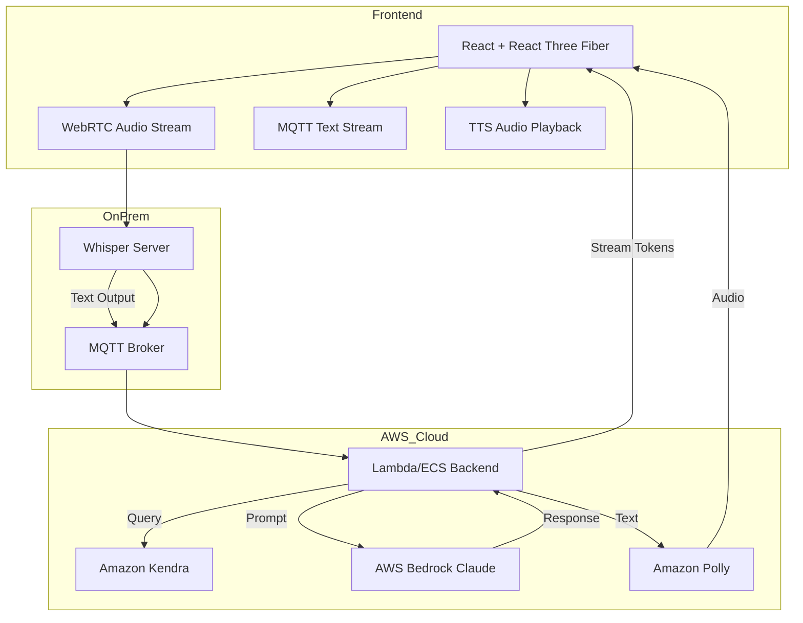

#  Interactive Solar System AI Tutor - Technical Implementation Plan

## Status Update (2026-01-01)

This AI tutor plan is a separate roadmap and is not implemented in this repository.

## 1. Objective
Develop a scalable, interactive, and cost-efficient **AI-powered Solar System Tutor** web app using React + Three.js (React Three Fiber), AWS AI services, and an on-prem speech recognition system.

---

## 2. System Overview
### Core Components:
- **Frontend:** React, React Three Fiber, Tailwind CSS
- **Backend:** AWS Lambda / ECS + MQTT broker
- **Speech System:** On-prem Whisper server (STT) + Polly/Coqui (TTS)
- **AI Orchestration:** AWS Bedrock (Claude 3 Haiku) + Kendra for retrieval
- **Communication:** MQTT over WebSocket + WebRTC (audio)
- **Hosting:** AWS Amplify + CloudFront

---

## 3. High-Level Architecture


---

## 4. Development Phases

| Phase | Goal | Major Deliverables | Duration |
|--------|------|--------------------|-----------|
| **Phase 1 (MVP)** | Text-based AI tutor + 3D visualization | R3F solar system, Bedrock Q&A, Kendra search, chat UI | 4-6 weeks |
| **Phase 2** | Add speech interactivity | Whisper STT, Polly TTS, WebRTC integration | 4 weeks |
| **Phase 3** | Add game & missions | Spaceship navigation, task manager, score system | 6 weeks |
| **Phase 4** | Scale & optimize | Cost monitoring, caching, ML model refinement | 4 weeks |

Total Estimated: **16-20 weeks (5 months)** for complete v1 release.

---

## 5. Frontend Implementation Plan

### 5.1 Folder Structure
```
/src
  /components
    SolarSystem.jsx
    Planet.jsx
    ShipGame.jsx
    ChatBox.jsx
  /hooks
    useAIChat.js
    useAudioStream.js
  /state
    useStore.js (Zustand)
  /services
    mqttClient.js
    bedrockAPI.js
  /assets
    textures/
  App.jsx
  index.jsx
```

### 5.2 Core Libraries
- **React Three Fiber** - 3D scene rendering
- **drei** - helpers for lights, orbit controls
- **Zustand** - lightweight state management
- **Axios / AWS SDK** - Bedrock + Kendra APIs
- **WebRTC** - audio streaming (STT/TTS)
- **MQTT.js** - real-time text sync with backend

---

## 6. Backend Implementation Plan

### 6.1 Lambda / ECS (AI Gateway)
**Responsibilities:**
- Accept text queries via MQTT
- Query **Kendra** -> retrieve relevant context
- Send contextual prompt -> **Bedrock (Claude)**
- Stream tokenized responses back over MQTT
- Optionally trigger Polly for speech synthesis

### 6.2 On-Prem Whisper Server
**Stack:** Python + FastAPI + WebSocket / WebRTC
```bash
pip install fastapi websockets openai-whisper
```
**Functionality:**
- Receive audio stream from browser
- Decode -> transcribe -> publish text to MQTT topic
- Manage concurrent sessions via UUIDs

### 6.3 MQTT Broker
- Use **Mosquitto** or **AWS IoT Core** (if scaling)
- Topics:
  - `solarai/fromClient/{sessionId}`
  - `solarai/fromServer/{sessionId}`

### 6.4 TTS System
- Use **Amazon Polly** for natural voice output
- Cache common responses in S3 or DynamoDB

---

## 7. Deployment & Scaling

### 7.1 Hosting
- **Frontend:** AWS Amplify (auto CI/CD + CloudFront CDN)
- **Backend:**
  - Light use -> AWS Lambda
  - Heavy concurrency -> ECS Fargate or EC2 GPU for AI pipeline
- **STT Server:**
  - On-prem GPU (RTX 3060/3070/3090) or local workstation
  - Dockerized for reproducibility

### 7.2 Scaling Strategy
| Component | Scaling Method | Limitations |
|------------|----------------|--------------|
| Frontend | CloudFront edge caching | None |
| MQTT Broker | Horizontal scaling with clustering | Needs session sync |
| Whisper Server | Multi-instance load balancing | Local GPU capacity |
| Lambda / ECS | Auto-scaling groups | Cost scales with traffic |
| Bedrock/Kendra | Pay-per-request | Easy to scale |

---

## 8. Estimated Monthly Cost (1000 Daily Active Users)
| Service | Est. Usage | Monthly Cost (USD) |
|----------|------------|--------------------|
| AWS Bedrock (Claude 3 Haiku) | 100K queries | $20-40 |
| Amazon Kendra | 50K retrievals | $25-30 |
| Amazon Polly | 10 hrs TTS | $5-10 |
| Amplify Hosting + CloudFront | Moderate traffic | $10-15 |
| MQTT Broker (EC2 / IoT Core) | ~1M msgs | $5-8 |
| On-Prem Whisper (GPU power) | Local electricity | ~$10-20 |
| **Total** |  | **$75-125 / month** |

---

## 9. Security & Privacy
- All voice/text processed locally or in AWS secure region
- HTTPS for all traffic, WSS for sockets
- IAM roles for Kendra/Bedrock/Polly isolation
- Session-based UUIDs for chat, no PII storage

---

## 10. Monitoring & Observability
- **CloudWatch** for Lambda/ECS logs
- **Grafana + Prometheus** for Whisper server metrics
- **AWS X-Ray** for tracing Bedrock/Kendra latency

---

## 11. Long-Term Scalability
- Modular plug-ins (space missions, new AI tutors)
- API Gateway wrapper for future mobile apps
- Integration with school dashboards (analytics, progress)
- Edge AI inference with **SageMaker Neo** for faster model serving

---

## 12. Summary
This plan defines a full-stack architecture combining **interactive 3D learning**, **AI-driven tutoring**, and **cost-optimized infrastructure**. The system scales from small pilot deployments (school labs) to global traffic (10K+ students) while maintaining privacy and affordability.

**Estimated full-stack build timeline:** ~5 months with 2-3 developers.
**Monthly operational cost:** ~$100 for 1000 DAU, scalable linearly with usage.

